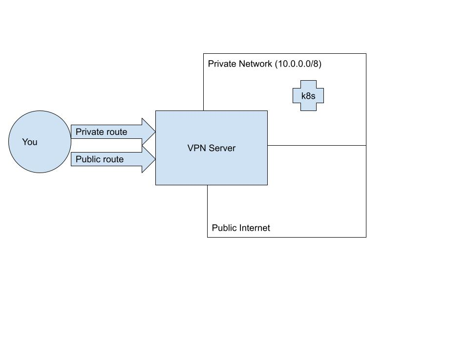
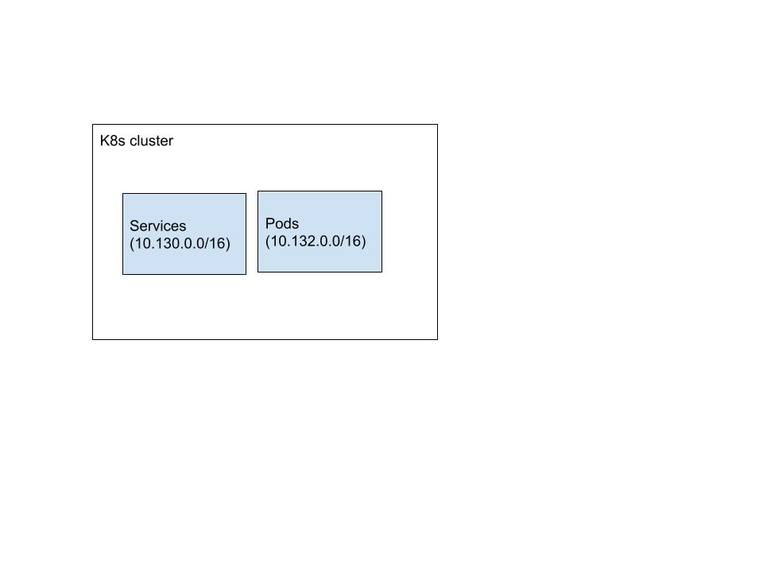
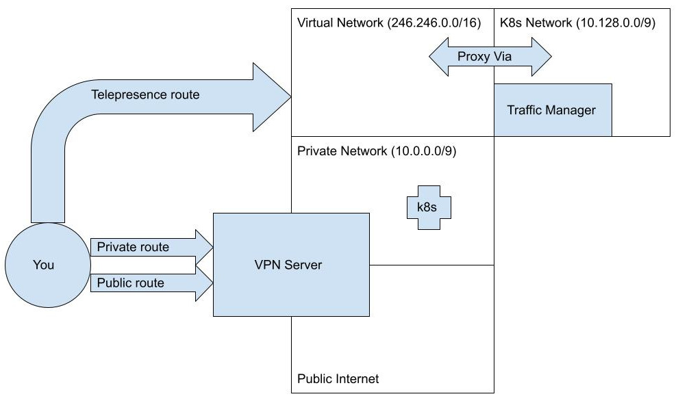

# Telepresence and VPNs

It is often important to set up Kubernetes API server endpoints to be only accessible via a VPN.
In setups like these, users need to connect first to their VPN, and then use Telepresence to connect
to their cluster. As Telepresence uses many of the same underlying technologies that VPNs use,
the two can sometimes conflict. This page will help you identify and resolve such VPN conflicts.

## VPN Configuration

Let's begin by reviewing what a VPN does and imagining a sample configuration that might come
to conflict with Telepresence.
Usually, a VPN client adds two kinds of routes to your machine when you connect.
The first serves to override your default route; in other words, it makes sure that packets
you send out to the public internet go through the private tunnel instead of your
ethernet or wifi adapter. We'll call this a `public VPN route`.
The second kind of route is a `private VPN route`. These are the routes that allow your
machine to access hosts inside the VPN that are not accessible to the public internet.
Generally speaking, this is a more circumscribed route that will connect your machine
only to reachable hosts on the private network, such as your Kubernetes API server.

This diagram represents what happens when you connect to a VPN, supposing that your
private network spans the CIDR range: `10.0.0.0/8`.



## Kubernetes configuration

One of the things a Kubernetes cluster does for you is assign IP addresses to pods and services.
This is one of the key elements of Kubernetes networking, as it allows applications on the cluster
to reach each other. When Telepresence connects you to the cluster, it will try to connect you
to the IP addresses that your cluster assigns to services and pods.
Cluster administrators can configure, on cluster creation, the CIDR ranges that the Kubernetes
cluster will place resources in. Let's imagine your cluster is configured to place services in
`10.130.0.0/16` and pods in `10.132.0.0/16`:



## Telepresence conflicts

When you run `telepresence connect` to connect to a cluster, it talks to the API server
to figure out what pod and service CIDRs it needs to map in your machine. If it detects
that these CIDR ranges are already mapped by a VPN's `private route`, it will produce an
error and inform you of the conflicting subnets:

```console
$ telepresence connect
telepresence connect: error: connector.Connect: failed to connect to root daemon: rpc error: code = Unknown desc = subnet 10.43.0.0/16 overlaps with existing route "10.0.0.0/8 via 10.0.0.0 dev utun4, gw 10.0.0.1"
```

Telepresence offers three different ways to resolve this:

- [Allow the conflict](#allowing-the-conflict) in a controlled manner
- [Avoid the conflict](#avoiding-the-conflict) using the `--proxy-via` connect flag
- [Use docker](#using-docker) to make telepresence run in a container with its own network config

### Allowing the conflict

One way to resolve this, is to carefully consider what your network layout looks like, and
then allow Telepresence to override the conflicting subnets.
Telepresence is refusing to map them, because mapping them could render certain hosts that
are inside the VPN completely unreachable. However, you (or your network admin) know better
than anyone how hosts are spread out inside your VPN.
Even if the private route routes ALL of `10.0.0.0/8`, it's possible that hosts are only
being spun up in one of the subblocks of the `/8` space. Let's say, for example,
that you happen to know that all your hosts in the VPN are bunched up in the first
half of the space -- `10.0.0.0/9` (and that you know that any new hosts will
only be assigned IP addresses from the `/9` block). In this case you
can configure Telepresence to override the other half of this CIDR block, which is where the
services and pods happen to be.
To do this, all you have to do is configure the `client.routing.allowConflictingSubnets` flag
in the Telepresence helm chart. You can do this directly via `telepresence helm upgrade`:

```console
$ telepresence helm upgrade --set client.routing.allowConflictingSubnets="{10.128.0.0/9}"
```

You can also choose to be more specific about this, and only allow the CIDRs that you KNOW
are in use by the cluster:

```console
$ telepresence helm upgrade --set client.routing.allowConflictingSubnets="{10.130.0.0/16,10.132.0.0/16}"
```

The end result of this (assuming an allow list of `/9`) will be a configuration like this:


### Avoiding the conflict

An alternative to allowing the conflict is to remap the cluster's CIDRs to virtual CIRDs
on the workstation by passing a `--proxy-via` flag to `teleprence connect`.

The `telepresence connect` flag `--proxy-via`, introduced in Telepresence 2.19, will allow the local DNS-server to translate cluster subnets to virtual subnets on the workstation, and the VIF to do the reverse translation. The syntax for this new flag, which can be repeated, is:

```console
$ telepresence connect --proxy-via CIDR=WORKLOAD
```
Cluster DNS responses matching CIDR to virtual IPs that are routed (with reverse translation) via WORKLOAD. The CIDR can also be a symbolic name that identifies a subnet or list of subnets:

| Symbol    | Meaning                             |
|-----------|-------------------------------------|
| `also`    | All subnets added with --also-proxy |
| `service` | The cluster's service subnet        | 
| `pods`    | The cluster's pod subnets.          | 
| `all`     | All of the above.                   |

The WORKLOAD is the deployment, replicaset, or statefulset in the cluster whose agent will be used for targeting the routed subnets.

This is useful in two situations:

1. The cluster's subnets collide with subnets otherwise available on the workstation. This is common when using a VPN, in particular if the VPN has a small subnet mask, making the subnet itself very large. The new `--proxy-via` flag can be used as an alternative to [allowing the conflict](#allowing-the-conflict) to take place, give Telepresence precedence, and thus hide the corresponding subnets from the conflicting subnet. The `--proxy-via` will instead reroute the cluster's subnet and hence, avoid the conflict.
2. The cluster's DNS is configured with domains that resolve to loop-back addresses (this is sometimes the case when the cluster uses a mesh configured to listen to a loopback address and then reroute from there). A loop-back address is not useful on the client, but the `--proxy-via` can reroute the loop-back address to a virtual IP that the client can use.

Subnet proxying is done by the client's DNS-resolver which translates the IPs returned by the cluster's DNS resolver to a virtual IP (VIP) to use on the client. Telepresence's VIF will detect when the VIP is used, and translate it back to the loop-back address on the pod.

#### Proxy-via and using IP-addresses directly

If the service is using IP-addresses instead of domain-names when connecting to other cluster resources, then such connections will fail when running locally. The `--proxy-via` relies on the local DNS-server to translate the cluster's DNS responses, so that the IP of an `A` or `AAAA` response is replaced with a virtual IP from the configured subnet. If connections are made using an IP instead of a domain-name, then no such lookup is made. Telepresence has no way of detecting the direct use of IP-addresses.

#### Virtual IP Configuration

Telepresence will use a special subnet when it generates the virtual IPs that are used locally. On a Linux or macOS workstation, this subnet will be
a class E subnet (not normally used for any other purposes). On Windows, the class E is not routed, and Telepresence will instead default to `211.55.48.0/20`.

The default can be changed using the configuration `cluster.virtualIPSubnet`.

#### Example

Let's assume that we have a conflict between the cluster's subnets, all covered by the CIDR `10.124.0.0/9` and a VPN using `10.0.0.0/9`. We avoid the conflict using:

```console
$ telepresence connect --proxy-via all=echo
```

The cluster's subnets are now hidden behind a virtual subnet, and the resulting configuration will look like this:



### Using docker

Use `telepresence connect --docker` to make the Telepresence daemon containerized, which means that it has its own network configuration and therefore no conflict with a VPN. Read more about docker [here](docker-run.md).
