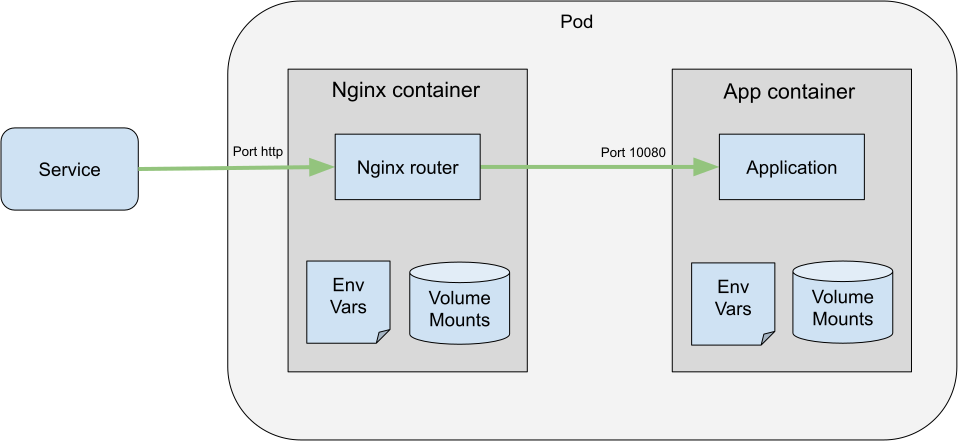
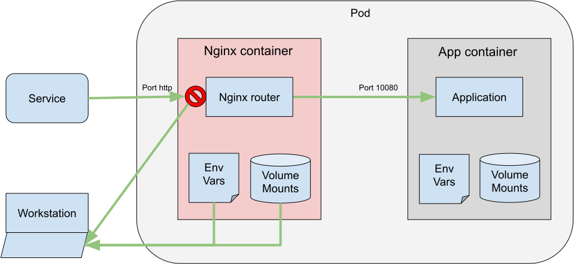
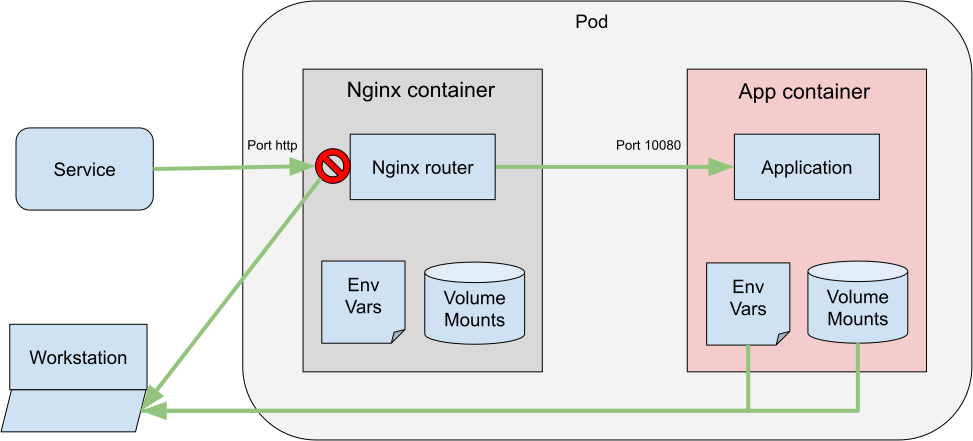

# Target a specific container
A `telepresence replace` or `telepresence ingest` will always target a specific container, and the `--container` flag is
mandatory when the workload has more than one container.

A `telepresence intercept` or `telepresence wiretap` will ultimately target a specific port within a container. The port
is usually determined by examining the relationship between the service's `targetPort` and the container's `containerPort`.

In certain scenarios, the container owning the intercepted port differs from the container the intercept
targets. This container's sole purpose is to route traffic from the service to the intended container,
often using a direct localhost connection. Use the `--container` flag with the intercept in these scenarios.

## No intercept

Consider the following scenario:



## Standard Intercept

During a replace, the Telepresence traffic-agent will redirect all traffic intended for the replaced container to the
workstation.  It will also make the environment and mounts for the **Nginx container** available, because it is
considered to be the one targeted by the intercept.

During an intercept, the Telepresence traffic-agent will redirect the `http` port to the workstation.
It will also make the environment and mounts for the **Nginx container** available, because it is
considered to be the one targeted by the intercept.

```console
$ telepresence intercept myservice --port http
```



## Intercept With --container

The `--container <name>` intercept flag is useful when the objective is to work with the App container
locally. While this option doesn't influence the port selection, it guarantees that the environment
variables and mounts propagated to the workstation originate from the specified container.

```console
$ telepresence intercept myservice --port http --container app
```


