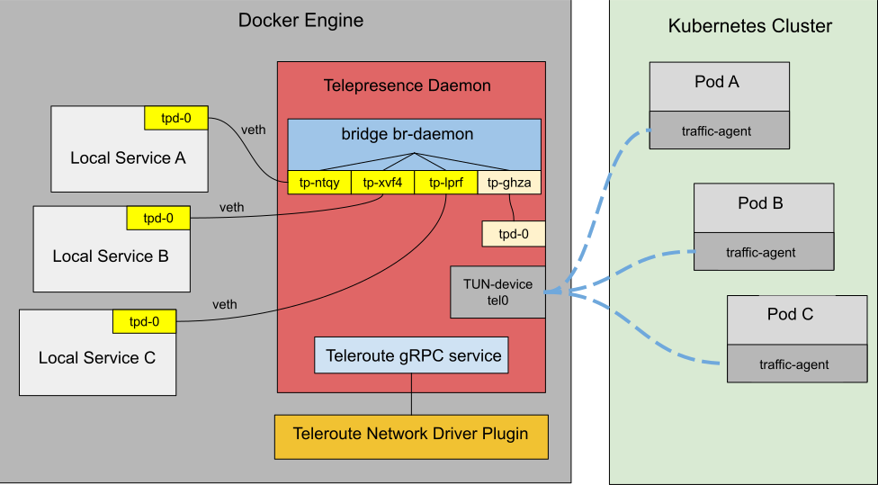

# Telepresence Docker Plug-ins

A Telepresence client started with `telepresence connect --docker` will run in a Docker container. This is great because
it means that the network that it creates, and the volumes that it mounts, will not interfere with the network and
mounts on the workstation. Thanks to the Docker plugins Teleroute and Telemount, it also means that those resources are
available to other containers in the form of a Docker network and as Docker volumes.

## Teleroute Network Plugin
The Telepresence Teleroute Docker network plugin is installed on demand and ensures that the cluster networks made
available by the daemon's virtual network interface (VIF) can be reached from other containers without interfering
with those container's network mode.

### Technical brief

This is the sequence of events that occur when the user runs `telepresence connect --docker`:

1. The Telepresence CLI checks if the Teleroute network driver plugin is present and installs it automatically[^1] if
   it's not found.
2. The Telepresence CLI starts the Telepresence daemon container using the default bridge network, so that it's assigned
   an IP address that the Teleroute network plugin can connect to.
3. The Telepresence daemon starts its `teleroute` gRPC service, and creates the "br-daemon" network bridge.
4. The Telepresence CLI creates a network that uses the same name as the telepresence connection[^1]. It is configured to 
   use the teleroute network driver and to connect to the Telepresence daemon's `teleroute` gRPC service using the
   daemon's IP address on the default bridge[^3].
5. The Telepresence CLI connects the daemon to the new network. The network driver forwards the join request to the
   daemon's `teleroute` service.
6. In response, the `teleroute` service creates a veth-pair, sets the "br-daemon" bridge as `master` over one end of
   that pair and moves the other end (the peer) to the network plugin's network namespace.
7. The network plugin then moves the veth peer again. This time to the connecting container's namespace (in this
   particular case, back to the daemon container).

Steps similar to 5, 6, and 7 will happen when another container connects to the teleroute network. The only difference
is that now, the plugin also adds routes to the container, enabling it to connect to the subnets exposed by the daemon's
VIF:

1. The network driver forwards the join request to the daemon's `teleroute` service.
2. In response, the `teleroute` service creates a veth-pair, sets the "br-daemon" bridge as `master` over one end of
   that pair and moves the other end (the peer) to the network plugin's network namespace.
3. The network plugin then moves the veth peer again. This time to the connecting container's namespace.
4. The network plugin adds the routes necessary to reach the daemon's VIF device via the daemon's IP to the connecting
   container.

#### DNS

A container will get all routes necessary to reach cluster resources by connecting to the teleroute network. It will
also be configured to use the Docker internal DNS so that all containers on the same network can find each other. It is,
however, not configured with a DNS that resolves names on the cluster side. One additional step is needed in order for
that to happen. The container must be started with `--dns <daemon container IP>` where the `<daemon container IP>` is
the IP that the daemon container was assigned when it connected to the teleroute network.

The container IP can be retrieved and then used together with the network like this:
```console
$ telepresence connect --docker --name blue
$ DAEMON_IP=$(telepresence status --output json | jq -r .daemon.dns.local_address | sed -e 's/:53//')
$ docker run --network blue --dns $DAEMON_IP --rm -it jonlabelle/network-tools
```

which is equivalent to using the Telepresence built-in `docker-run` command like this:

```console
$ telepresence connect --docker --name blue
$ telepresence docker-run --rm -it jonlabelle/network-tools
```

When Telepresence starts a docker container, either by using `telepresence curl`, `telepresence docker-run` commands, or
by using the `--docker-{run|build|debug}` flag in an engagement command, the following happens:

1. The container will automatically be connected to the teleroute network.
2. The container will get its DNS configured to use the DNS server exposed by the Telepresence daemon.

Picture showing a Teleroute network connected to a daemon container and three local services



## Telemount Volume Plugin

The Telepresence Telemount Docker volume plugin is installed on demand and ensures that remote directories that are made
available by SFTP-servers in the traffic-agents can be mounted as Docker volumes. The driver is configured when a
containerized Telepresence daemon is started, so that volumes can be created when Telepresence engages with a remote
container using `telepresence {ingest|intercept|replace|wiretap}`. These commands make a port available in the daemon
that connects the network driver with the remote SFTP-server.

This is the sequence of events that occur when the user runs `telepresence connect --docker`:

1. A check is made if the Telemount volume plugin is present. If not, it is installed automatically[^4].
2. The daemon configures itself to use a bridge mounter. This mounter is just a proxy that makes the port used by a
   remote traffic-agent's SFTP server available on the daemon containers localhost.

When Telepresence engages a container using the `--docker-{run|build|debug}` flag in an engagement command, the 
following happens:

1. A full list of volumes to be mounted is established. The command options are scanned for `-v`, `--volume` and
   `--mount` flags, and those flags are then merged with the mounts propagated from the traffic-agent of the engaged
   pod. The command options are given priority in this merge.
2. A `docker create volume --driver=telemount` is executed for each volume in the list, passing the port number of the
   proxied SFTP server to the volume plugin.
3. The container is started with `-v` flags appointing the newly created volumes.
4. The telemount performs SFTP mounts of the volumes, as needed.

When the container engagement ends, the volumes are unmounted and removed, and the telepresence daemon closes the
SFTP proxy.

[^1]: The plugin registry, name, and tag can be fully configured using the `docker.teleroute` in the `config.yml`
      configuration file.

[^2]: The connection name is either given by the user using the `--name <name>` flag, or automatically generated from
      the kubernetes context and cluster namespace, e.g. "docker-desktop-default"

[^3]: The default port used for this connection is 4039, but it can be reconfigured using the `grpc.teleroutePort` in
      the `config.yml` configuration file.

[^4]: The plugin registry, name, and tag can be fully configured using the `docker.telemount` in the `config.yml`
configuration file.
