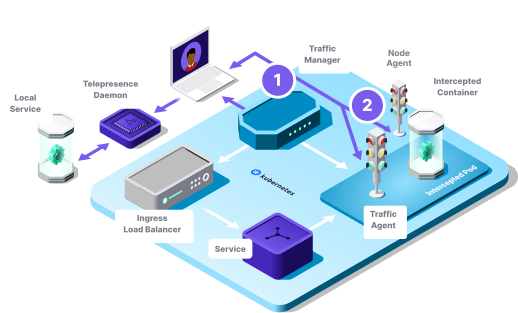

# Telepresence Architecture

## Telepresence CLI

The Telepresence CLI orchestrates the moving parts on the workstation: it starts the Telepresence Daemons and then acts
as a user-friendly interface to the Telepresence User Daemon.

## Telepresence Daemons
Telepresence has Daemons that run on a developer's workstation and act as the main point of communication to the cluster's
network in order to communicate with the cluster and handle intercepted traffic.

### User-Daemon
The User-Daemon coordinates the creation and deletion of replacements, ingests and intercepts by communicating with the [Traffic Manager](#traffic-manager).
All requests from and to the cluster go through this Daemon.

### Root-Daemon
The Root-Daemon manages the networking necessary to handle traffic between the local workstation and the cluster by setting up a
[Virtual Network Device](../reference/routing.md#the-virtual-network-interface) (VIF).

## Traffic Manager

The Traffic Manager is the central point of communication between Traffic Agents in the cluster and Telepresence Daemons
on developer workstations. It is responsible for injecting the Traffic Agent sidecar into attached pods (or, when the cluster is configured for it,
creating a [node-hosted agent](../reference/node-agent.md) instead), proxying all relevant inbound and outbound
traffic, and tracking active attachments.

The Traffic-Manager is installed by a cluster administrator. It can either be installed using the Helm chart embedded
in the telepresence client binary (`telepresence helm install`) or by using a Helm Chart directly.

## Traffic Agent

The Traffic Agent is the component that facilitates attachments. When a `replace`, `ingest`, `intercept`, or `wiretap`
is first started, it is normally injected into the workload's pod(s) as a sidecar container. A cluster administrator
can instead configure the Helm chart to run it as a node-hosted pod that attaches to the existing pod's namespaces
without modifying or restarting it — see
[Choose between the sidecar and the node-agent](../howtos/agent-modes.md). You can see the Traffic Agent's status by
running `telepresence list` or `kubectl describe pod <pod-name>`.

Depending on if an `replace` or `intercept` is active or not, the Traffic Agent will either route the incoming request 
to your workstation, or it will pass it along to the container in the pod usually handling requests.

When a `wiretap` is active, the Traffic Agent will send a copy of the incoming requests to your workstation.

Please see [Traffic Agent Sidecar](../reference/attachments/sidecar.md) and [Node-hosted traffic-agent](../reference/node-agent.md) for details.