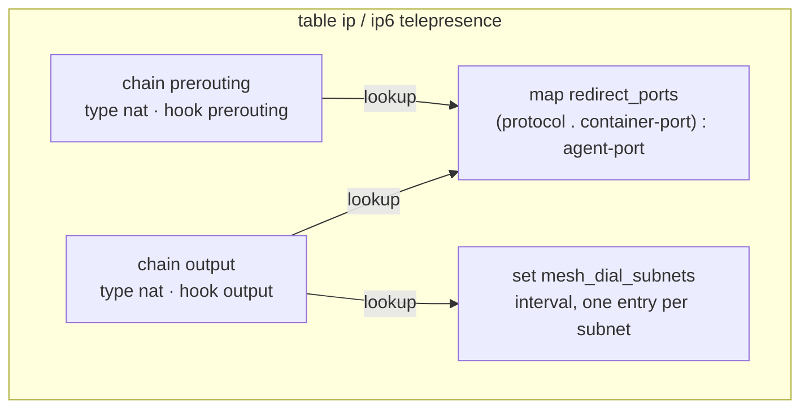
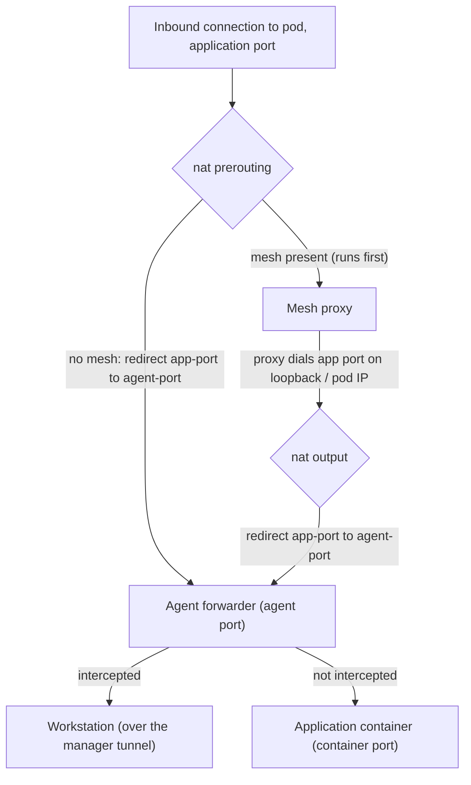
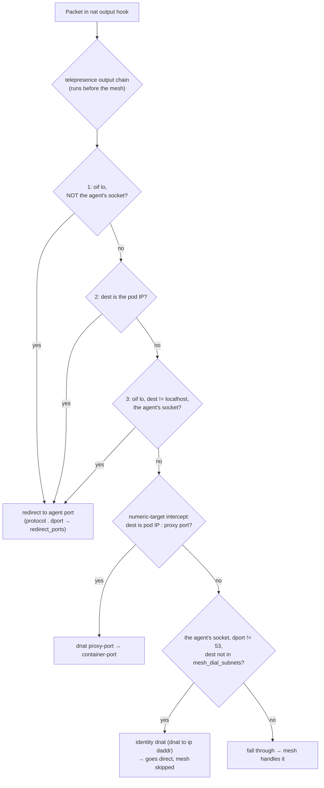
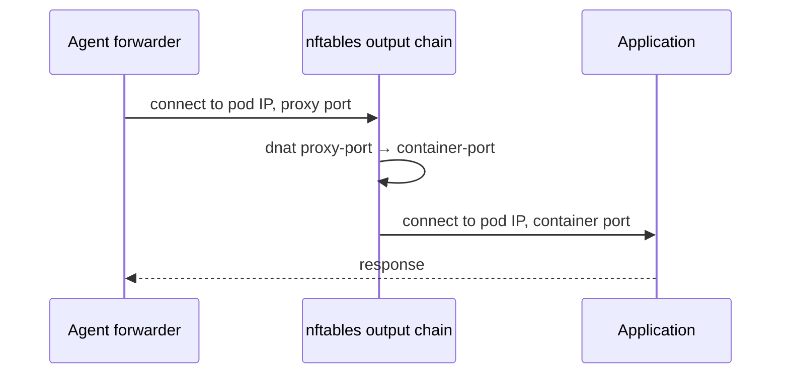

The traffic-agent steers network traffic inside its pod using **nftables**. When
the agent is injected, an initialization step programs a dedicated nftables
table in the pod's network namespace, and the agent process runs *forwarders*
that this table directs traffic to. A [node-hosted agent](node-agent.md) programs
the very same table into the target pod's network namespace from outside the
pod. The rules do two jobs:

1. **Interception** — steer traffic bound for the application's ports into the
   agent's forwarders, so it can be delivered to an intercepting workstation or
   passed through to the application unchanged.
2. **Mesh isolation** — keep the agent's own outbound traffic flowing directly,
   so it is not captured by a service-mesh proxy running in the same pod.

All rules are programmed natively through the kernel's netlink interface; no
command-line tools are involved.

## Ports and identity

A few concepts recur throughout:

| Term | Meaning |
|------|---------|
| **container port** | The port the application container listens on. |
| **agent port** | The port an agent forwarder listens on for a given intercept. |
| **proxy port** | A port the forwarder uses to hand traffic back to the application without re-triggering interception (see [Pass-through](#pass-through-to-the-application)). |
| **agent GID** | A group ID the traffic-agent runs under. It is chosen to be distinct from every application container in the pod, so nftables can tell agent-originated packets apart from application packets. |

The agent's distinct GID is the linchpin of mesh isolation: a packet's owning
group is available in the output hook as `meta skgid`, so rules can match "this
packet was sent by the agent" versus "this packet was sent by the application
or a mesh proxy."

## The `telepresence` table

The agent installs one table per address family — `table ip telepresence` and
`table ip6 telepresence` — each containing two base chains, a redirect map,
and a set:

- **`prerouting`** and **`output`** are `nat`-type base chains. Their hook
  priorities are chosen relative to a service mesh's own NAT chains (see
  [Coexistence](#coexistence-with-a-service-mesh)):
  - `prerouting` sits **just after** the standard destination-NAT priority, so a
    mesh's inbound redirect runs first.
  - `output` sits **just before** it, so the agent's NAT decisions take
    precedence over a mesh's outbound redirect.
- **`redirect_ports`** maps each intercepted (protocol, container port) pair to
  its agent port. The key concatenates the transport protocol and the
  container port, so one map -- and one lookup rule wherever it's needed --
  covers every protocol; a port can still be intercepted on both TCP and UDP
  with distinct agent ports, since the protocol is part of the key.
- **`mesh_dial_subnets`** is an interval set of address ranges that must always
  be routed by the mesh proxy (typically a mesh's virtual range for external
  services).

The entire table is installed in one atomic netlink transaction, and removed in
one transaction when the agent shuts down.

## Inbound path

Traffic arriving at the pod for an application port is delivered to the agent
forwarder, which then decides whether to tunnel it to an intercepting
workstation or pass it through to the application.

- **Without a mesh**, the `prerouting` chain looks the (protocol, destination
  port) pair up in the redirect map and redirects the connection to the agent
  port.
- **With a mesh**, the mesh's inbound redirect (higher precedence) delivers the
  connection to its proxy first. When the proxy forwards the request to the
  application port over loopback or the pod IP, the `output` chain redirects
  *that* to the agent port. The agent thus sees mesh-processed traffic, and the
  mesh is never bypassed on the inbound path.

In both cases the forwarder receives the connection on the agent port and, for
an active intercept, tunnels it to the workstation; otherwise it passes it
through to the application.

## Outbound path

The `output` chain runs before a mesh's outbound NAT, so its decisions win. Its
rules are evaluated in order; a packet that matches none of them falls through
to the mesh unchanged. The chain matches on the packet's owning group
(`meta skgid`) and destination:

The chain expresses three behaviors:

1. **Redirect application-port traffic (three rules).** A connection to an
   application port is redirected to the agent port in three cases: traffic
   leaving via loopback that is *not* the agent's own (a mesh proxy dialing the
   application), traffic addressed to the pod IP regardless of who sent it (a
   mesh proxy dialing the application by IP, or the agent reaching an
   intercepted pod by IP), and the agent's *own* traffic leaving via loopback
   for anything other than localhost (intercept-by-IP and headless-service
   interception). All three look the (protocol, destination port) pair up in
   the same `redirect_ports` map described above.
2. **Rewrite the pass-through proxy port.** For intercepts with a numeric
   target port, a separate rule rewrites the proxy port back to the container
   port; see [Pass-through](#pass-through-to-the-application).
3. **Keep the agent's own traffic direct, except DNS and
   mesh_dial_subnets (one rule).** The agent's outbound connections (its link
   to the traffic-manager, and connections it dials on behalf of intercepting
   workstations) receive an **identity DNAT** — `dnat to ip daddr`, which maps
   the connection to the destination it already has. This pins the
   connection's NAT decision, so a mesh's later outbound redirect is skipped
   and the packet reaches its original destination directly. DNS (port 53) and
   destinations in `mesh_dial_subnets` are matched first and excluded, so they
   fall through to the mesh instead: DNS is delegated so that names only the
   mesh can resolve are resolved for the workstation too, and
   `mesh_dial_subnets` covers destinations only the mesh proxy knows how to
   route.

   This bypass rule carries no protocol match, even though it excludes DNS by
   reading a destination port straight out of the transport header at a fixed
   offset. That read only lines up with an actual port field for protocols
   that carry one there, such as TCP and UDP; for any other protocol the rule
   still applies an identity DNAT, but that changes nothing about the packet
   -- it is a no-op for exactly the protocols a mesh would never redirect
   anyway, so leaving out a protocol check costs nothing.

### Pass-through to the application

When a forwarder is not intercepting, it must hand the connection to the
application without the `prerouting`/`output` redirect sending it straight back
to the agent port. To break that loop, the forwarder sends pass-through traffic
to a **proxy port**, and the `output` chain carries a DNAT rule that rewrites
the proxy port to the real container port:

## Coexistence with a service mesh

Interception and mesh isolation both rely on two properties of the NAT hooks
rather than on sharing rules with the mesh:

- **Base-chain priority** determines the order in which independently-installed
  NAT chains are traversed at a hook.
- **Connection tracking** records a NAT mapping on a connection's first packet;
  once any chain has set a mapping, later chains' NAT statements are a no-op for
  that connection.

Together these give the agent exactly the ordering it needs:

- On **prerouting**, the agent's chain runs *after* the mesh's, so inbound
  traffic is delivered to the mesh proxy first and only redirected to the agent
  when the proxy forwards it (via the output path above).
- On **output**, the agent's chain runs *before* the mesh's, so the agent's
  redirect (for application-port traffic) and identity DNAT (for the agent's own
  egress) set the connection's NAT mapping first — the mesh's outbound redirect
  then has no effect on those connections, while every other connection falls
  through to the mesh untouched.

Because this depends only on priority and connection tracking — never on
inserting rules into another component's chain — it behaves identically whether
the mesh (or the cluster's service proxy) programs nftables through its own
tables directly or through a compatibility layer.

## Lifecycle

The table is built as a complete, self-contained ruleset and applied to the
pod's network namespace in a single atomic transaction during agent
initialization. It is removed with a single atomic transaction when the agent
terminates, leaving the network namespace as it was found.

## Related

Cluster-wide service-CIDR handling is performed separately by the route
controller; see [route-controller](route-controller.md).
