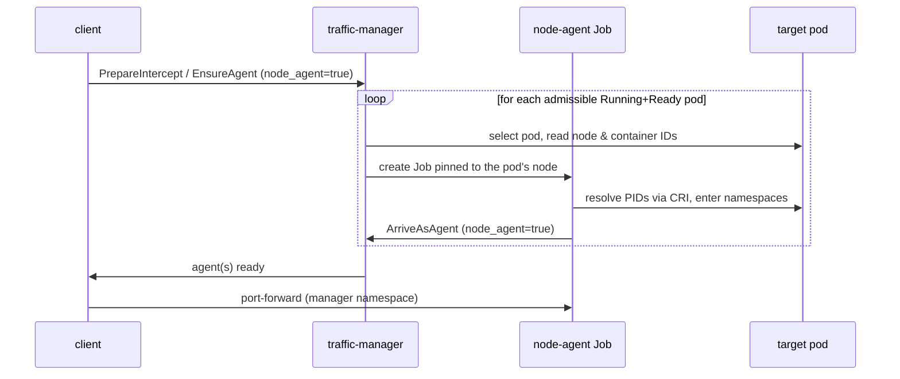

The traffic-agent normally runs as a **sidecar**: a mutating webhook rewrites
the workload's pod template, and the pods restart with the agent container
injected. The **node-agent** is a second deployment mode that provides the
same capabilities — intercepted traffic, wiretaps, environment, and volume
mounts — with **no workload mutation and no pod restart**. Instead of living
inside the pod, the agent runs as a node-pinned Job that enters the *existing*
target pod's Linux namespaces from the outside.

The mode is enabled by the cluster administrator: the traffic-manager must
be installed with `nodeAgent.enabled=true`, and the administrator can make
the node-agent the default for all attachments by also setting the Helm
chart's `client.nodeAgent.enabled` value. A workstation can override that
default with the `nodeAgent.enabled` setting in its local `config.yml`, and
a single `telepresence intercept`, `telepresence wiretap`, or
`telepresence ingest` attachment can pick a mode explicitly with the
`--node-agent` flag, which always wins. See
[Choose between the sidecar and the node-agent](../howtos/agent-modes.md)
for configuration examples.

## When to use it

Use a node-agent when mutating or restarting the workload is undesirable or
disallowed: pods with expensive startup, workloads whose spec is reconciled by
an operator that fights the webhook, or clusters where the agent-injector is
disabled entirely (`agentInjector.enabled=false` — node-agent attachments do
not need the webhook).

The trade-off is privilege. A node-agent pod runs with `hostPID: true`, a
read-only `hostPath` mount of the node's container-runtime socket, and the
`SYS_ADMIN`, `SYS_PTRACE`, `NET_ADMIN`, and `NET_RAW` capabilities. The
traffic-manager's namespace — where the Jobs are created — must therefore
permit the *privileged* Pod Security Standard. Clusters that reject `hostPID`
by admission (such as GKE Autopilot) cannot run node-agents; the sidecar
remains the mode for those.

## Lifecycle: the traffic-manager owns the Job

No new controller and no client-side pod creation is involved: the
traffic-manager creates, pins, monitors, and reaps the node-agent, just as it
already orchestrates sidecar injection.

1. **Target selection.** For an intercept, the manager selects *every*
   admissible Running and Ready pod of the workload — matching the sidecar's
   every-replica coverage — and records each one's node, its IP, and the CRI
   container ID of every configured container. A pod that cannot host a
   node-agent is skipped with a log line rather than failing the whole
   request: pods on the host network (whose namespace the [route
   controller](route-controller.md) also programs), pods that already
   contain an injected traffic-agent sidecar, and pods running in their own
   user namespace (`hostUsers: false` — see [Limitations](#limitations)). The
   request fails only when no pod is admissible. An **ingest** is the
   exception: it reads env and mounts from a single pod, so it reuses an
   existing Job that still targets an admissible pod, or creates a Job for
   just one target if none exists — a Job per replica would buy it nothing.
2. **Job creation.** A Job is created in the *traffic-manager's* namespace
   for each target pod, pinned to that pod's node via `spec.nodeName`, and
   carries the same `AGENT_CONFIG` a sidecar would receive, plus that pod's
   container IDs and pod IP. The node's container-runtime socket is mounted
   read-only: the one named by the Helm value `nodeAgent.criSocket` when set,
   or the node's `/run` directory by default, in which case the agent picks
   the well-known CRI socket that recognizes the target's containers —
   containerd, CRI-O, k3s, or cri-dockerd (the docker runtime). Each Job's
   name is deterministic — a hash of the target namespace and pod name under
   a per-agent prefix — so a retried request resolves to the Job already
   created for the same target, and Jobs for different pods of the same
   workload can never collide. A Job whose target has changed (container
   restart), whose pod failed, or that is still terminating is replaced,
   never reused.
3. **Registration.** Once inside the target's namespaces the agent calls
   `ArriveAsAgent` like any traffic-agent, with a `node_agent` flag on its
   `AgentInfo`. From that point the manager's intercept machinery treats it
   like a sidecar, with one twist on the client: the agent's gRPC, SFTP, and
   FTP servers listen in the *Job pod's* own network namespace, so the client
   port-forwards to the Job pod in the manager's namespace rather than to a
   workload pod.
4. **Reaping.** The Job never completes on its own, so its lifetime is
   tracked server-side. A single predicate decides whether an agent's Job is
   still wanted: a live node-agent intercept exists for the workload, or an
   ingest *lease* is held by a live client session. Every removal path
   consults it — the intercept-removal finalizer, the `ReleaseAgent` call
   that ends an ingest, client-session expiry, and a periodic reconciler
   that sweeps orphans (covering manager restarts and clients that vanished
   between preparing and creating an attachment). Jobs are always deleted
   with foreground propagation, so a successor Job for the same target can
   never program the shared nftables table while a predecessor's terminating
   pod could still tear it down. On `helm uninstall`, a pre-delete hook has
   the manager reap every remaining node-agent Job, mirroring how injected
   sidecars are rolled back.

### Replica churn

While any attachment claims a workload, the manager keeps a live watch on its
pods and reconciles the Job set as replicas come and go, so coverage does not
freeze at the set that existed when the attachment started. A new replica
gets its own Job once it becomes Running and Ready; a removed replica's Job
is reaped as soon as its pod is actually gone — a pod that merely turns
un-Ready keeps its Job. A rolling restart falls out of the same mechanism:
the old pods' Jobs are reaped as those pods disappear and the new pods each
get a Job as they become ready, with no special casing beyond what an
intercept already tolerates during a sidecar rollout.

## Entering the target pod

The namespaces of the target are entered per concern; nothing is executed
inside the target's containers.

| Concern | Mechanism |
|---------|-----------|
| **PID resolution** | The kubelet-reported CRI container IDs are resolved to host PIDs over the mounted container-runtime socket (`ContainerStatus` with verbose info; containerd, CRI-O, and cri-dockerd all report the `pid` there). One connection is dialed and reused for all containers. |
| **Environment** | Read from `/proc/<pid>/environ` — the fully resolved, post-startup environment of the running container, with entry order and duplicates preserved. The same prefixing and filtering as the sidecar's `AppEnvironment` applies afterwards. |
| **Filesystem** | Served from `/proc/<pid>/root/...`: the agent populates its exports directory with symlinks that the kernel resolves in the target's mount namespace. The SFTP/FTP servers, the reported mount points, and the client are unchanged from the sidecar. |
| **Network** | Entered explicitly. Netfilter rules are programmed from outside via a netlink socket bound to the target's netns file descriptor. Listen and dial sockets are created *inside* the target netns by locking an OS thread, `setns(2)`-ing it into the namespace, creating the socket, and restoring the thread (a thread whose restore fails is never returned to Go's thread pool). The namespace fd is opened once per agent and reused. |

## Packet routing

The ruleset is the same one the sidecar's init container installs — see
[Traffic-agent packet routing](agent-packet-routing.md) for the full
description. The node-agent builds it from its `AGENT_CONFIG` and applies it
to the **target pod's** network namespace via netlink (`WithNetNSFd`); its
forwarders listen on the agent ports inside that same namespace, so redirected
traffic arrives exactly as it would for a sidecar. Three details differ from
the sidecar, all consequences of running outside the pod:

- **Session-driven table lifecycle.** The sidecar's init container programs
  the table once at pod start; the node-agent installs it when the Job starts
  and removes it (an atomic table delete) when the Job ends. The idempotent
  full-replace apply makes retries and agent restarts converge.
- **The ownership discriminator is selected per target.** The agent's own
  sockets in the target netns carry the agent GID (the Job runs with
  `RunAsGroup` set to the agent GID), so the sidecar's `meta skgid` owner
  match works unchanged for ordinary pods. For pods in their own user
  namespace the kernel cannot install an owner match from the host, and a
  packet-mark discriminator is required; until that is wired, such targets
  are rejected (see [Limitations](#limitations)).
- **Pass-through dials happen in the target netns.** Traffic that must reach
  the real application (an inactive intercept, a wiretap's original stream,
  or a filtered HTTP intercept's non-matching requests) is dialed through the
  same thread-locking mechanism, so it traverses the target's own NAT rules:
  the proxy port for numeric target ports, or loopback for named ones —
  identical semantics to the sidecar.

## DNS

Client DNS lookups are never delegated to a node-agent. A sidecar shares the
workload's DNS view (same namespace search path, same mesh resolver), which is
why the client normally prefers resolving through an attached agent. A
node-agent's pod resolves with the *manager* namespace's search path, so the
client falls back to the traffic-manager, which qualifies single-label names
against the client's connected namespace itself. Names only resolvable inside
a service mesh (e.g. Istio `ServiceEntry` hosts) are consequently not
resolvable while attaching through a node-agent.

## Coexistence rules

The node-agent and the sidecar can serve different workloads side by side,
but never the same workload at the same time; the manager rejects the
combinations that would break one of them:

| Requested | Existing state | Result |
|-----------|----------------|--------|
| node-agent attachment | pod already has an injected sidecar | rejected — both would program the same nftables table and bind the same agent ports |
| sidecar attachment | live node-agent intercept or ingest on the workload | rejected — injection would restart the pod the node-agent is attached to |
| second node-agent intercept | live node-agent intercept on the same workload | allowed — attachments share the workload's Jobs; the same conflict rules as the sidecar apply (concurrent global intercepts of one port still conflict) |
| node-agent ingest | live node-agent intercept (or other ingest) on the workload | allowed — the Job is shared and reference-counted via leases |

## Limitations

- **Privileged posture required.** The manager's namespace must admit
  privileged pods; clusters that ban `hostPID` cannot run node-agents.
- **`--replace` is not supported.** Replacing a container is implemented by
  the injection machinery, which node-agent mode never runs.
- **User-namespaced pods are not supported yet.** A `hostUsers: false` pod
  needs the packet-mark discriminator (`SO_MARK`) instead of the GID owner
  match; until that lands, such targets are rejected with a clear error.
- **Named-port pass-through requires a loopback listener.** The application
  must accept connections on loopback or a wildcard address for pass-through
  of named target ports. A sidecar shares this requirement only when its pod
  carries the agent's nftables ruleset (some intercept has a numeric target
  port or is headless); the node-agent always programs the ruleset.
- **Mesh-only DNS names** are not resolvable during a node-agent attachment
  (see [DNS](#dns)).
